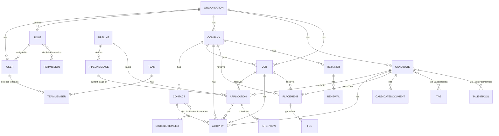

# Entity Relationships

Full schema: `packages/database/prisma/schema.prisma` (38 models). This
document is the narrative + diagram companion — read it alongside the
schema, not instead of it.

## Core ERD

## Relationship notes

| Relationship                                             | Cardinality | Notes                                                                                                                                                              |
| -------------------------------------------------------- | ----------- | ------------------------------------------------------------------------------------------------------------------------------------------------------------------ |
| Company → Contact                                        | 1 → N       | `Contact.companyId` required — a contact always belongs to exactly one company                                                                                     |
| Company → Job                                            | 1 → N       | `Job.companyId` required                                                                                                                                           |
| User → Role                                              | N → 1       | **Single role per user** (`User.roleId`), not many-to-many. Simplicity over flexibility — see [../architecture/authorization.md](../architecture/authorization.md) |
| Role ↔ Permission                                        | N ↔ N       | Via `RolePermission` — a role is a named bundle of permissions from the global `Permission` catalog                                                                |
| Candidate → Application                                  | 1 → N       | A candidate may have many applications, one per job (`@@unique([candidateId, jobId])`)                                                                             |
| Job → Application                                        | 1 → N       |                                                                                                                                                                    |
| Application → Candidate / Job / Pipeline / PipelineStage | N → 1 each  | The join point of the ATS pipeline — see below                                                                                                                     |
| Pipeline → PipelineStage                                 | 1 → N       | Ordered (`order Int`, `@@unique([pipelineId, order])`)                                                                                                             |
| Application → Pipeline, Application → PipelineStage      | N → 1 each  | Application carries **both** directly — see "Why Application owns pipelineId" below                                                                                |
| Candidate/Company/Contact/Job/Application → Activity     | 1 → N each  | All nullable FKs on the same `Activity` row                                                                                                                        |
| Candidate/Company/Contact/Job/Application → Task         | 1 → N each  | Same nullable-FK pattern as Activity                                                                                                                               |
| Candidate/Contact/Company/Job/Application → Comment      | 1 → N each  | Same pattern again — see "Why Comment/Document use plain FKs, not polymorphism"                                                                                    |
| Candidate/Company/Contact/Job/Application → Document     | 1 → N each  | Generic file attachments; `CandidateDocument` is the separate, CV-specific table                                                                                   |
| Candidate → CandidateDocument                            | 1 → N       | CV/résumé/cover letter, metadata only — bytes live in object storage                                                                                               |
| Candidate ↔ Tag                                          | N ↔ N       | Via `CandidateTag`, which also records `taggedById`/`createdAt`                                                                                                    |
| Candidate ↔ TalentPool                                   | N ↔ N       | Via `TalentPoolMember`                                                                                                                                             |
| Contact ↔ DistributionList                               | N ↔ N       | Via `DistributionListMember`                                                                                                                                       |
| Candidate/Job/Company → Placement                        | each 1 → N  | A placement always references all three                                                                                                                            |
| Placement → Fee                                          | 1 → N       | A placement can generate more than one fee line                                                                                                                    |
| Company → Retainer                                       | 1 → N       |                                                                                                                                                                    |
| Retainer → Renewal                                       | 1 → N       |                                                                                                                                                                    |
| User → Activity/Task/CalendarEvent/AuditLog              | 1 → N each  | `Task` disambiguates via named relations (`assignedToId` vs `createdById`, both → User)                                                                            |
| Organisation → (almost everything)                       | 1 → N       | The tenant boundary — see [../architecture/multi-tenancy.md](../architecture/multi-tenancy.md)                                                                     |

## Why Application is its own entity (not a Job FK on Candidate)

A `Candidate` has no `jobId`. The ATS pipeline is strictly
`Candidate → Application → Job`: a candidate can be active on many jobs
simultaneously, each with its own stage, status, source, and owner. Putting
a single `jobId` on `Candidate` would make multi-job pipelines and
historical applications (a candidate re-applying after being rejected)
unrepresentable. `Application` also unique-constrains `[candidateId,
jobId]` so "did this candidate already apply here" is a database guarantee,
not an application-level check that can race.

## Why Application owns `pipelineId` directly (not inherited via Job)

`Application.pipelineId` and `Application.pipelineStageId` are both direct
fields, rather than resolving the pipeline through `Job`. This keeps a
job's pipeline choice and a specific application's pipeline independent —
an application can be tracked through whichever pipeline makes sense for
that candidate/job pairing without a schema change, and every query that
needs "what pipeline/stage is this application at" reads two columns on
one row instead of joining through Job. `PipelineStage.type`
(`STANDARD`/`PLACED`/`REJECTED`) is what lets business logic recognize a
placement-triggering or rejection-triggering stage move without
string-matching a stage's display name — never hard-code stage names in
frontend or backend code.

## Why Comment/Document use plain FKs, not polymorphism

`Comment` and `Document` each attach to one of five entity types
(Candidate/Company/Contact/Job/Application). Rather than a generic
`entityType` + `entityId` pair (which drops real foreign-key integrity —
the database can no longer guarantee `entityId` actually points at
something that exists), both models carry five explicit nullable FK
columns, exactly like `Activity` and `Task` already did. The tradeoff is a
handful of always-null columns per row; the payoff is a real, enforced
foreign key and a query planner that understands the relationship. Five
FK columns is cheap; broken referential integrity is not.

## The one deliberate exception: `Tag`/`CandidateTag`

Tagging is the opposite case: a single, identical capability (attach a
label) that would otherwise need near-duplicate join tables
(`CandidateTag`, `CompanyTag`, `ContactTag`, `JobTag`) with zero behavioral
difference between them. Phase 1 implements `CandidateTag` only — the case
actually in use — and keeps `Tag` itself generic (just `organisationId` +
`name`) so `CompanyTag`/`ContactTag`/`JobTag` can be added later as
ordinary join tables, not a redesign.

## Full model list

38 models across tenancy/identity/RBAC (Organisation, User, Role,
Permission, RolePermission, Team, TeamMember), companies/contacts (Company,
Contact), candidates (Candidate, CandidateDocument, Tag, CandidateTag),
jobs (Job), the ATS pipeline (Pipeline, PipelineStage, Application),
activity/tasks/calendar/interviews (Activity, Task, CalendarEvent,
Interview), email (EmailThread, EmailMessage), documents/comments
(Document, Comment), talent pools/distribution lists (TalentPool,
TalentPoolMember, DistributionList, DistributionListMember), revenue
(Placement, Fee, Retainer, Renewal), notifications (Notification), reports/
analytics (Report, UserEngagementEvent), audit logging (AuditLog), and
integrations (Integration). See `packages/database/prisma/schema.prisma`
for the authoritative, up-to-date field lists.
