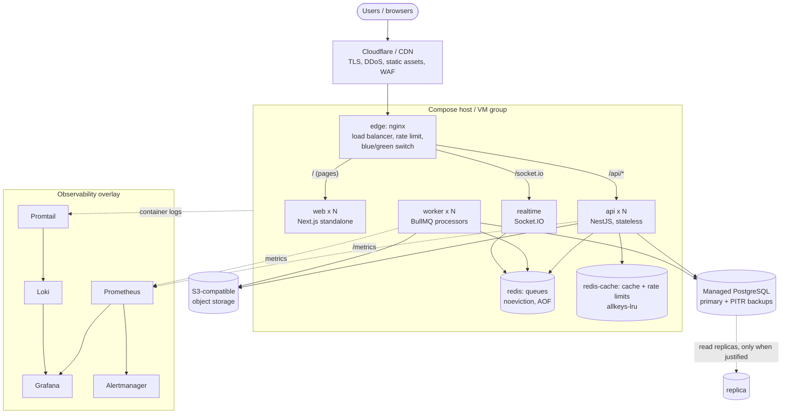

# Production architecture

The application stays a **modular monolith** (Next.js + NestJS + BullMQ workers + PostgreSQL + Redis). What changes for
production is how it is packaged and connected so that every tier can be scaled, replaced and observed independently.
No business logic, API contract or UI is different in this setup.



## The two request paths

```
USER -> CDN -> edge -> web (Next.js) -> [browser] TanStack Query -> edge -> api (NestJS)
                                                                       |
                                                        Redis cache (opt-in) -> PostgreSQL
Heavy work:  api -> Redis queue -> worker -> PostgreSQL / object storage
```

* **Interactive requests** are served by `api` replicas. They are bounded by indexes, `LIMIT`, and (opt-in) the Redis
  cache. They never do CPU-heavy work that can be queued.
* **Heavy work** (CV parsing, imports/exports, reports, e-mail) belongs in `worker`, which scales on its own. See
  "Workers" below for what is wired today.

## What "stateless API" means here, and what enforces it

Any replica must be able to serve any request. State therefore lives in shared systems, never in one process:

| State | Where it lives | How |
| --- | --- | --- |
| Sessions / auth | Signed JWT + httpOnly cookies; refresh tokens in PostgreSQL | No per-process session store. |
| Rate-limit counters | Redis (`THROTTLER_STORAGE=redis`) | Sliding window in one Lua script; falls back to per-process counting if Redis is down. |
| Scheduled sweeps (`@Cron`) | Redis lock (`SCHEDULER_LOCK=redis`) | One replica per tick; without it every replica would send every reminder. |
| Cache | Redis (`CACHE_ENABLED=true`) | Tenant-versioned keys; fail-open. |
| Uploaded files | S3-compatible object storage | `STORAGE_PROVIDER=local` keeps files on one instance's disk, so it cannot serve several replicas (the API logs a warning at boot in production). |
| Realtime rooms | Socket.IO rooms `org:<id>` / `user:<id>` | With more than one realtime replica add the Redis adapter (see `scaling.md`). |
| Client IP behind the proxy | `TRUST_PROXY=1` | Otherwise every user shares one rate-limit bucket. |

## Tenant isolation is preserved end to end

* Database: unchanged — `TenantGuard` + `scopedPrisma` on every tenant-scoped query.
* Cache keys always begin `tenant:{organisationId}:`; the id comes from the validated token (never from request input).
  Covered by an automated test that two tenants get different values under the same logical key.
* Rate limits are per client IP (tenant-agnostic by design).
* Logs never contain credentials: `Authorization`, `Cookie`, `Set-Cookie` and `x-api-key` are redacted.
* Metrics never carry a tenant, user or record id as a label (route *patterns* only).

## Failure behaviour (designed, and tested)

| Failure | Behaviour |
| --- | --- |
| Redis cache/limiter down | API keeps serving with **identical responses** (cache bypass, per-instance limits). `/health/ready` goes 503 only if `HEALTH_REQUIRE_REDIS=true`. Replicas reconnect on their own. |
| Redis queue down | New jobs cannot be enqueued (loud error at the call site); workers resume when it returns. Queue Redis must run `noeviction` + AOF. |
| PostgreSQL down | `/health/ready` 503 -> LB drains the replica; `/health` (liveness) stays 200 so the process is not restarted in a loop. |
| A replica is deployed / scaled down | `SIGTERM` -> readiness flips to 503 -> `SHUTDOWN_DRAIN_MS` wait -> in-flight requests finish -> exit. |
| A bad release | `rollback.sh` flips the edge back in seconds (the previous colour is still running for a grace period). |

## Workers: what is wired today

`apps/worker` runs nine BullMQ processors (email, documents, cv-parsing, notifications, analytics, reports, imports,
exports, scheduled-tasks). **They are currently stubs**: the API does not enqueue to them yet, and the worker has no
database access wired up. The deployment topology (separate image, separate scaling, graceful shutdown, queue Redis
with `noeviction`) is ready; moving a workload onto it is per-feature work:

* CV/PDF/DOCX parsing runs **inside the HTTP request** today (`POST /candidates/parse-resume`, 10 MB limit) and
  returns the parsed fields synchronously, which the UI relies on. Moving it to a queue while keeping that contract
  means enqueue + wait for the result (bounded), which is a follow-up listed in `performance.md`.
* Reminder sweeps run in the API process behind `SchedulerLockService` (one replica per tick).
